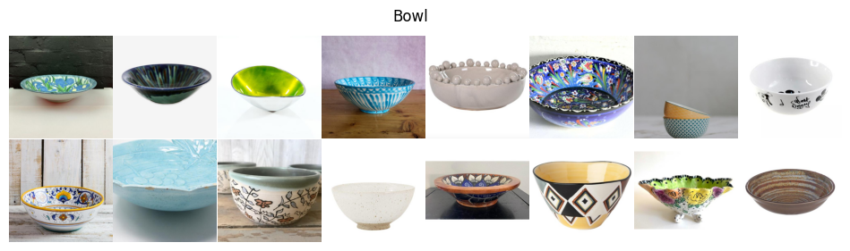
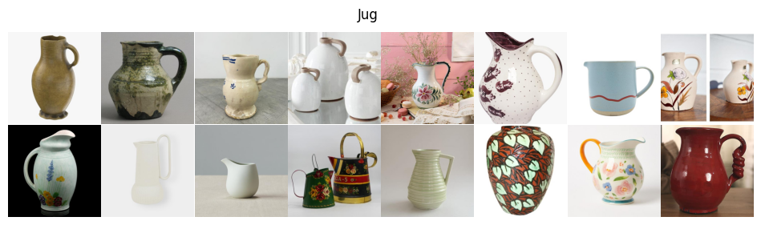
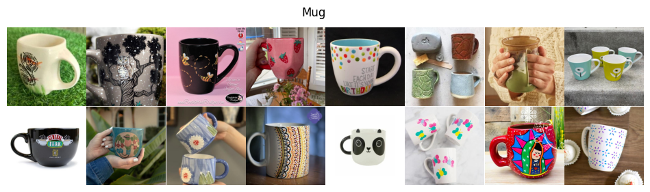
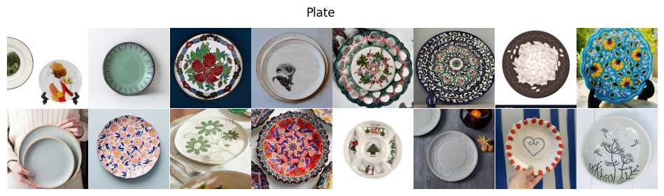
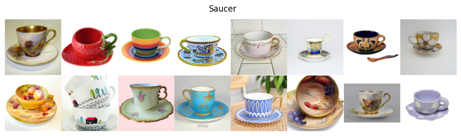
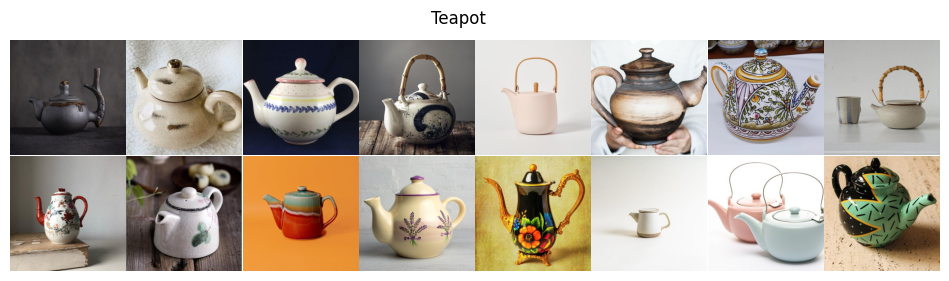

# Painted Ceramic Dataset
The Ceramic Dataset consists of 8,065 real-world images, each sized at 512x512 pixels. With six distinct classes, this dataset showcases a diverse collection of painted ceramics, offering a valuable resource for tasks such as image classification and image generation.

